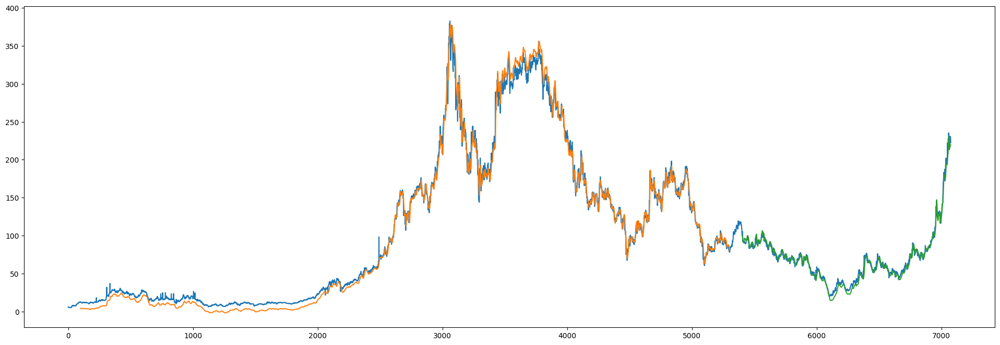

Certainly! Below is a sample `README.md` file for a Python project focused on Stock Prediction using an LSTM model and data obtained from Yahoo Finance for the stock named BHEL:

```markdown
# Stock Prediction with LSTM for BHEL

This Python project utilizes Long Short-Term Memory (LSTM) neural networks to predict stock prices for BHEL (Bharat Heavy Electricals Limited). The historical stock data is obtained from Yahoo Finance using the `yfinance` library.

## Prerequisites

Make sure you have the required dependencies installed:

```bash
pip install yfinance
pip install pandas
pip install numpy
pip install scikit-learn
pip install tensorflow
```
## Usage

1. Clone the repository:

```bash
git clone https://github.com/yourusername/stock-prediction-bhel.git
cd stock-prediction-bhel
```

2. Install dependencies:

```bash
pip install -r requirements.txt
```

3. Run the main script:

```bash
python main.py
```
## Accuracy 
The blue line is the original data
The orange line is the predicted training data
The green line is the predicted testing data



## Acknowledgments

- [yfinance](https://pypi.org/project/yfinance/): Library to fetch financial data from Yahoo Finance.
- [TensorFlow](https://www.tensorflow.org/): Open-source machine learning framework.
- [Pandas](https://pandas.pydata.org/): Data manipulation and analysis library.
- [NumPy](https://numpy.org/): Library for numerical operations.
- [Scikit-learn](https://scikit-learn.org/): Machine learning library for data mining and data analysis.


